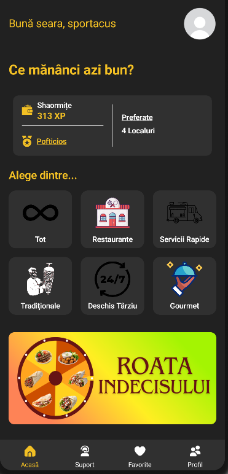

# Shaorma Finder 🌯📍

## Download Link: https://play.google.com/store/apps/details?id=com.denis.shaormafinder

**Shaorma Finder** este o aplicație Android nativă dedicată comunității din Iași, creată pentru a simplifica procesul de a găsi cea mai bună mâncare rapidă. Aplicația combină geolocația în timp real cu o bază de date dinamică pentru a oferi utilizatorilor cea mai scurtă rută către pofta lor.




## 📖 Despre Proiect

Acest proiect a început în noiembrie ca o inițiativă de a aprofunda **Google Maps SDK** și **Firebase**, dar a evoluat rapid într-un produs complex. De la un simplu locator, am dezvoltat un ecosistem complet cu funcții de gamification, filtrare avansată și tracking live.

În prezent, aplicația este în stadiul **Closed Beta** pe Google Play Store, fiind testată activ de utilizatori reali.

## ✨ Funcționalități Cheie

### 1. Smart Discovery & Filtrare
Utilizatorii pot căuta restaurante specifice folosind bara de căutare sau pot explora categorii inteligente. Sortarea se face dual: după popularitate sau după **distanța calculată live** față de poziția utilizatorului.
* **Categorii:** Tot, Restaurante, Tradițional, Deschis Târziu, Servire Rapidă, Gourmet.
* **Subcategorii:** Pui, Vită, Falafel, Gyros, etc.


### 2. Live Maps & Tracking 🗺️
Integrare profundă cu Google Maps Cloud.
* **Live Distance:** Distanța se actualizează în timp real pe măsură ce utilizatorul se mișcă.
* **Vizualizare Hartă:** La selectarea unui restaurant, se deschide o hartă live cu pin-ul utilizatorului și cel al restaurantului, arătând ruta și apropierea în timp real.


### 3. Roata Indecisului 🎲
O funcționalitate interactivă pentru momentele de indecizie. Utilizatorul învârte roata, iar algoritmul alege aleatoriu o locație surpriză din apropiere.


### 4. Profil Utilizator & Gamification 🏆
Pentru a crește engagement-ul, am implementat un sistem de progresie.
* **XP & Niveluri:** Utilizatorii câștigă experiență interacționând cu aplicația.
* **Customizare:** Posibilitatea de a schimba poza de profil și numele.
* **Wishlist:** Salvarea locațiilor preferate în lista de "Favorite" pentru acces rapid.


## 🛠️ Tech Stack

* **Limbaj:** Java / Android SDK
* **Backend:** Firebase Realtime Database (stocare date restaurante, useri)
* **Hărți:** Google Maps SDK for Android & Google Cloud Console
* **Autentificare:** Firebase Auth
* **UI/UX:** XML Layouts, Material Design Components
* **Altele:** Glide (pentru încărcare imagini), Location Services.

## ⚙️ Setup & Instalare (Pentru developeri)

Dacă dorești să rulezi proiectul local, vei avea nevoie de propriile chei API.

1.  Clonează repository-ul:
    ```bash
    git clone [https://github.com/username-ul-tau/Shaorma-Finder.git](https://github.com/username-ul-tau/Shaorma-Finder.git)
    ```
2.  Deschide proiectul în **Android Studio**.
3.  Configurează API Keys:
    * Creează un proiect în Google Cloud Console și activează **Maps SDK for Android**.
    * Creează un proiect în **Firebase** și descarcă fișierul `google-services.json` în folderul `app/`.
    * Adaugă cheia de Maps în `AndroidManifest.xml` sau `local.properties`.
4.  Build & Run pe un emulator sau device fizic (cu GPS activat).

## 🚀 Status Proiect

* [x] Interfață utilizator & Navigare
* [x] Integrare Firebase & Maps
* [x] Sistem Favorite & Search
* [x] Roata Indecisului
* [x] Publicare în Closed Beta (Google Play)
* [ ] Lansare oficială Publică

## 🤝 Credite & Inspirație

Dezvoltarea inițială a structurii de bază a fost inspirată de tutorialul [Food App](https://www.youtube.com/watch?v=-l-9n2DLyJg), peste care am construit și refăcut arhitectura pentru a include funcționalitățile avansate (Live Tracking, XP System, Favorite, Search, Support, Profile Edit).

---
*Developed with ❤️ in Iași by Dumitriu Denis.*
